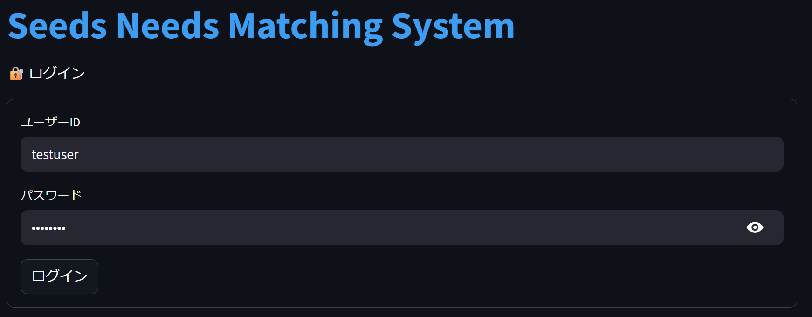
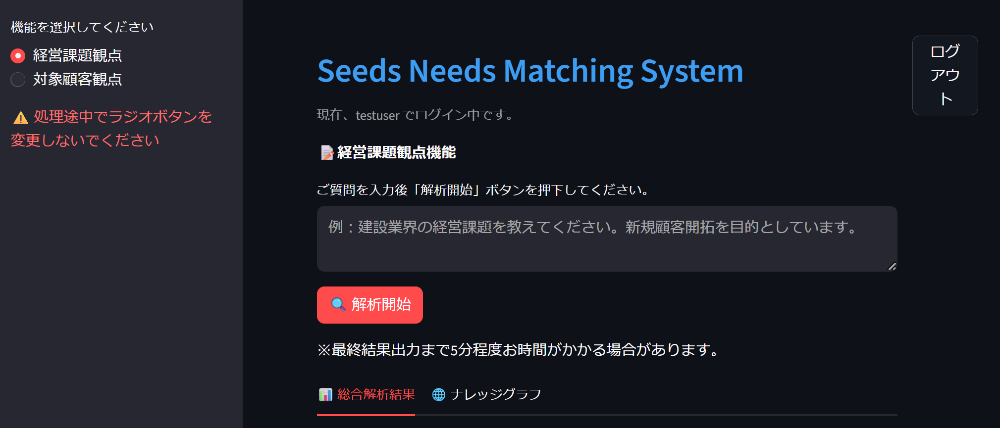
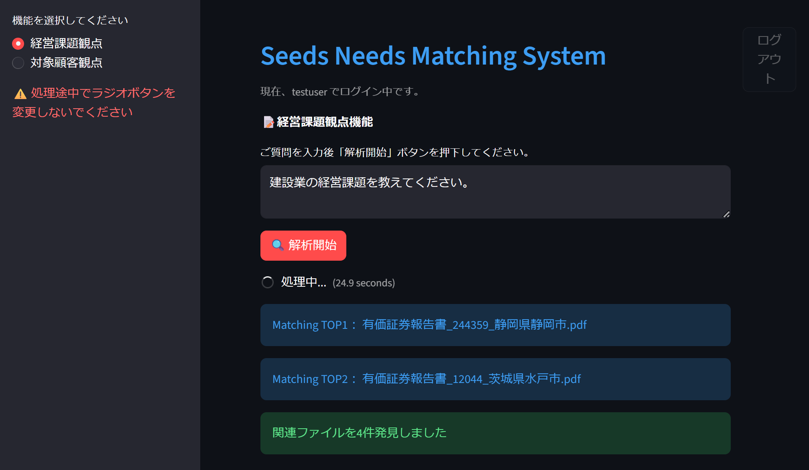
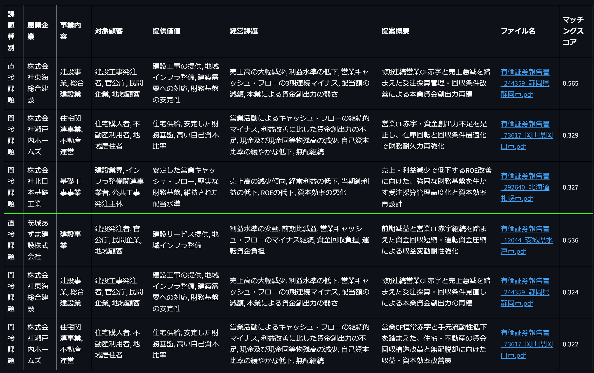
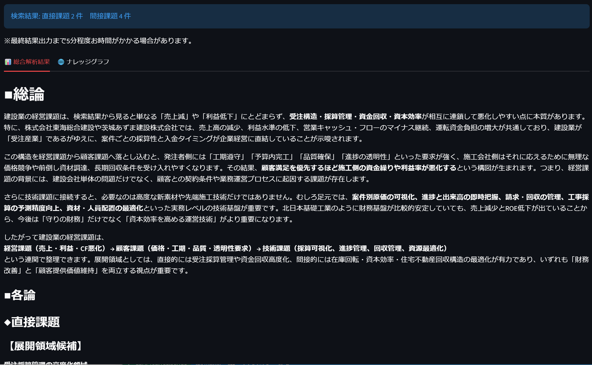
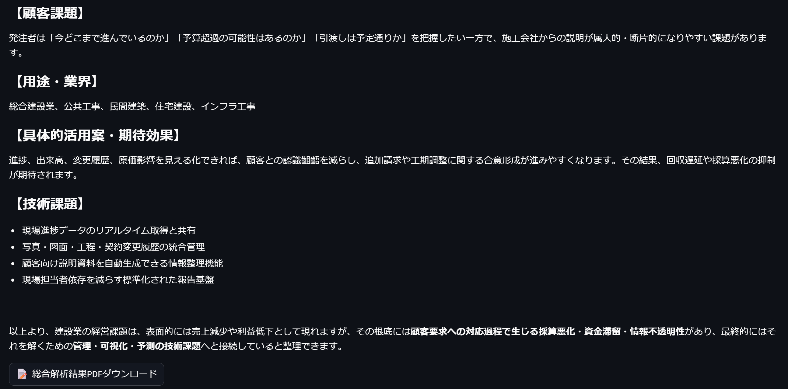
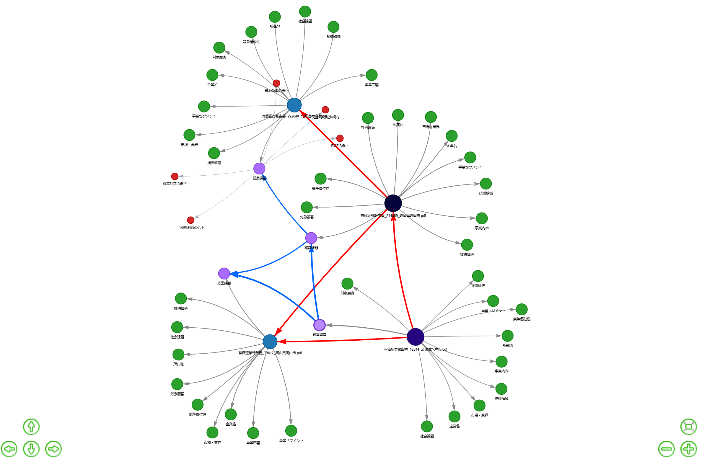

# Seeds Needs Matching System

Azure OpenAI、Azure AI Search、Azure Cosmos DB for Apache Gremlin を組み合わせた、ニーズ・シーズ探索支援アプリケーションです。  
企業・技術文書からメタ情報を抽出し、検索インデックスとナレッジグラフを構築することで、ユーザーの相談内容に対して「技術展開可能性」「関連文書」「総合解析結果」を提示します。

## 概要

本プロジェクトでは、Blob Storage 上の `needs/` と `seeds/` 配下の文書を対象に、以下の処理を行います。

1. Azure AI Document Intelligence で文書本文を抽出
2. Azure OpenAI で本文要約、検索用要約、12種類のメタ情報を抽出
3. Azure OpenAI Embeddings でベクトル化
4. Azure AI Search にハイブリッド検索用インデックスとして登録
5. Azure Cosmos DB for Apache Gremlin にメタ情報ベースのナレッジグラフを構築
6. Streamlit UI から「経営課題観点」「対象顧客観点」で検索・グラフ探索・解析結果出力を実行

## 主な機能

- Azure AI Search の日本語全文検索、ベクトル検索、セマンティック検索を組み合わせたハイブリッド検索
- 文書ごとのメタ情報抽出
  - 企業名
  - 所在地
  - 事業セグメント
  - 事業内容
  - 提供価値
  - 対象顧客
  - 市場・業界
  - 経営課題
  - 社会課題
  - 技術領域
  - 研究開発テーマ
  - 競争優位性
- Cosmos DB for Apache Gremlin によるメタ情報ノード・関連エッジの構築
- `target_customer` と `business_challenge` の類似度に基づく関連文書探索
- PyVis によるナレッジグラフ可視化
- Azure OpenAI による候補文書の要約・総合解析
- 解析結果の PDF 出力
- Streamlit による簡易ログイン付き UI

## アーキテクチャ

```text
Azure Blob Storage
  ├─ needs/
  └─ seeds/
      ↓
Azure AI Document Intelligence
      ↓
Azure OpenAI
  ├─ 要約生成
  ├─ メタ情報抽出
  └─ Embedding生成
      ↓
┌──────────────────────────────┐
│ Azure AI Search              │
│ - full text search           │
│ - vector search              │
│ - semantic search            │
└──────────────────────────────┘
      ↓
┌──────────────────────────────┐
│ Azure Cosmos DB for Gremlin  │
│ - File                       │
│ - MetaType                   │
│ - MetaInfo                   │
│ - related_target_customer    │
│ - related_business_challenge │
└──────────────────────────────┘
      ↓
Streamlit UI
```

## ファイル構成

```text
.
├── 1_create_search_index.py
├── 2_register_batch_N.py
├── app.py
├── matching/
│   ├── app_business_challenge.py
│   ├── app_target_customer.py
│   └── fonts/
│       └── fonts-japanese-gothic.ttf
├── requirements.txt
├── pyproject.toml
└── README.md
```

### `1_create_search_index.py`

Azure AI Search のインデックスを作成するスクリプトです。

- 日本語解析器 `ja.microsoft` を利用
- 3072次元の `content_vector` を定義
- HNSW によるベクトル検索プロファイルを設定
- セマンティック検索構成 `semantic-config` を設定
- メタ情報フィールドを facetable な検索対象として定義

実行時は既存インデックスを削除してから再作成します。開発・再構築用途のため、既存データがある環境で実行する場合は注意してください。

### `2_register_batch_N.py`

文書データを Azure AI Search と Cosmos DB for Apache Gremlin に登録するバッチです。

主な処理は以下です。

- Blob Storage の `needs/`、`seeds/` 配下から文書を取得
- Document Intelligence `prebuilt-layout` でテキスト抽出
- Azure OpenAI で本文要約と Embedding 用要約を生成
- 12種類のメタ情報を抽出
- `text-embedding-3-large` 相当の3072次元 Embedding を生成
- Azure AI Search に検索用ドキュメントを登録
- Gremlin に `File`、`MetaType`、`MetaInfo` ノードを作成
- `target_customer`、`business_challenge` の類似度に基づき関連エッジを作成
- バッチ単位で登録し、AI Search と Gremlin の整合性を確認
- 処理ログを `2_batch.log` に出力

### `app.py`

Streamlit UI のエントリポイントです。

- 簡易ログイン画面
- サイドバーで機能切り替え
  - 経営課題観点
  - 対象顧客観点
- ログイン後のメイン画面表示
- `matching/app_business_challenge.py` と `matching/app_target_customer.py` の呼び出し

### `matching/app_business_challenge.py`

経営課題観点のマッチング処理を提供します。

- 入力クエリを Azure OpenAI で検索向けに圧縮
- Azure AI Search でハイブリッド検索を実行
- 検索上位文書を起点に Gremlin の `business_challenge` 関連エッジを探索
- 関連文書の候補理由を生成
- 技術展開可能性の一覧を表示
- 総合解析結果を生成
- ナレッジグラフを可視化
- PDF ダウンロード用データを生成

### `matching/app_target_customer.py`

対象顧客観点のマッチング処理を提供します。  
構成は `app_business_challenge.py` と同様で、Gremlin の `target_customer` 関連エッジを探索対象とします。

## セットアップ

Python 3.12 を使用します。

```bash
uv init ディレクトリ名 --python 3.12
cd ディレクトリ名
uv add -r requirements.txt
source .venv/bin/activate
```

## 環境変数

プロジェクトルートに `.env` を作成し、Azure リソースの接続情報を設定します。  
実際のキーや接続文字列はリポジトリにコミットしないでください。

```env
# Azure Blob Storage
AZURE_BLOB_CONNECTION=
AZURE_BLOB_NAME=
AZURE_BLOB_KEY=
AZURE_BLOB_CONTAINER_NAME=

# Azure AI Document Intelligence
AZURE_AI_DOCUMENT_INTELLIGENCE_ENDPOINT=
AZURE_AI_DOCUMENT_INTELLIGENCE_ENDPOINT_API_KEY=

# Azure AI Search
AZURE_AI_SEARCH_ENDPOINT=
AZURE_AI_SEARCH_INDEX=
AZURE_AI_SEARCH_ADMIN_KEY=
AZURE_AI_SEARCH_KEY=

# Azure Cosmos DB for Apache Gremlin
AZURE_COSMOSDB_GREMLIN_ENDPOINT=
AZURE_COSMOSDB_GREMLIN_DB=
AZURE_COSMOSDB_GREMLIN_CONTAINER_TARGET_CUSTOMER=
AZURE_COSMOSDB_GREMLIN_CONTAINER_BUSINESS_CHALLENGE=
AZURE_COSMOSDB_GREMLIN_READ_WRITE_KEY=

# Azure OpenAI
AZURE_OPENAI_ENDPOINT=
AZURE_OPENAI_KEY=
AZURE_OPENAI_API_VERSION=
AZURE_OPENAI_MODEL_DEPLOYMENT=
AZURE_OPENAI_MODEL_EMBEDDING_LARGE=
```

## 実行手順

### 1. Azure AI Search インデックス作成

```bash
python 1_create_search_index.py
```

このスクリプトは既存インデックスを削除してから作成します。

### 2. 文書データ登録

Blob Storage の対象コンテナに、以下のような構成で文書を配置します。

```text
<container>
├── needs/
└── seeds/
```

その後、バッチを実行します。

```bash
python 2_register_batch_N.py
```

バッチは文書抽出、要約、メタ情報抽出、Embedding、AI Search 登録、Gremlin グラフ構築、関連エッジ作成までを実行します。

### 3. UI 起動

```bash
streamlit run app.py
```

初期状態では簡易ログインとして以下のアカウントが設定されています。

```text
ユーザーID: testuser
パスワード: testuser123
```

## UI の利用イメージ

1. ログインする
2. サイドバーで観点を選択する
   - 経営課題観点
   - 対象顧客観点
3. 相談内容や探索したいテーマを入力する
4. `解析開始` を押す
5. 上位マッチ文書、関連文書、技術展開可能性、総合解析結果、ナレッジグラフを確認する
6. 必要に応じて解析結果を PDF 出力する



---



---



---



---


：  
：  


---



## 実装上のポイント

- 検索精度向上のため、全文検索・ベクトル検索・セマンティック検索を併用
- 文書本文と Embedding 用要約を分け、回答生成用コンテキストと検索用表現を使い分け
- メタ情報を12分類で構造化し、検索インデックスとグラフDBの両方で活用
- `target_customer` と `business_challenge` を別々の Gremlin コンテナで管理し、観点別探索を実現
- 類似度上位のメタタイプ同士を関連エッジとして保持し、単純なキーワード検索では見つけにくい候補を探索
- バッチ処理では登録成功・失敗を記録し、AI Search と Gremlin の不整合が出た場合にロールバックを実行
- UI は Streamlit で構築し、検索、LLM解析、グラフ可視化、PDF出力までを一画面で操作可能

## 注意事項

- `1_create_search_index.py` は既存インデックスを削除します。本番データがある環境では実行前に確認してください。
- `2_register_batch_N.py` は初回登録時に Gremlin グラフをクリアして再構築します。
- Azure OpenAI、Document Intelligence、AI Search、Cosmos DB の利用料金が発生します。
- UI のログインは簡易実装です。本番利用では Azure Entra ID などの認証方式に置き換えることを想定しています。

## 技術スタック

- Python 3.12
- Streamlit
- Azure OpenAI
- Azure AI Search
- Azure AI Document Intelligence
- Azure Blob Storage
- Azure Cosmos DB for Apache Gremlin
- Gremlin Python
- PyVis
- scikit-learn
- ReportLab
